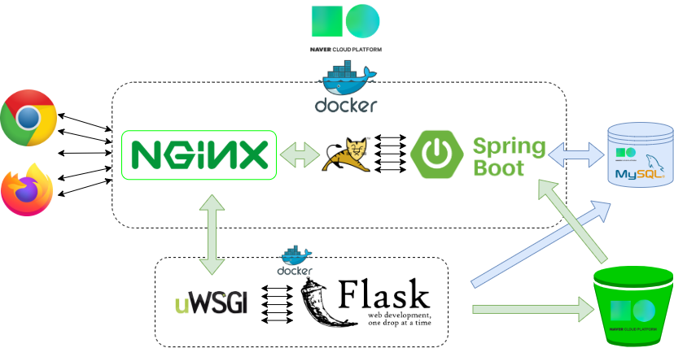

# 웹서버 실행방법(dev)


USE STACK

CM - Git, Github, gitkraken

HTML, CSS, JAVASCRIPT

library - JQuery, Ajax, 

Framework - Bootstrab 


환경설정

- Docker desktop 2.2.0.3 (Engine 19.03.8)
- Nginx 1.17.4
- jdk 13.0
- gradle 6.2.2
- spring boot 2.2.6
- python 3.6
- Flask 1.1.1
- tensorflow 1.15.2





## MySQL 서버

```bash
# /mysql
docker-compose up
```


## Flask 서버 설정

- python 도커 이미지 만들기
- uwsgi-flask 서버 이미지 만들기


### python 도커 이미지 만들기

```bash
# /predict/python
docker build -t gmimg/python:tf1.15.2 .
```


### uwsgi-flask 서버 이미지 만들기

```bash
# /predict/flask/src/config.py 키값 설정
# /predict/flask
docker build -t flask:test .
docker run --gpus all -p 5000:5000 -it -rm --name flask flask:test
```


## 웹 서버 jar 배포파일 만들기

```bash
# WEB/spring-boot/src/main/resources/application.yml 키값 설정
```


### gradle 있을때

```shell
# /WEB/spring-boot/application
gradle bootjar
```


### docker 이용서버 실행

windows

```powershell
# cmd
docker run --rm -u gradle -v %cd%:/home/gradle/project -w /home/gradle/project gradle:6.2.2-jdk13 gradle build

# powershell
docker run --rm -u gradle -v ${pwd}:/home/gradle/project -w /home/gradle/project gradle:6.2.2-jdk13 gradle build
```

linux

```bash
# ubuntu
docker run --rm -u gradle -v $(pwd):/home/gradle/project -w /home/gradle/project gradle:6.2.2-jdk13 gradle build
```


### nginx 서버 설정

```bash
# /WEB/nginx/default.conf
upstream flask_uwsgi {
  server ${ip}:5000; # => ip를 플라스크 서버로 바꿔야함
}
...
```


## 실행

```shell
# /WEB
docker-compose up
```
